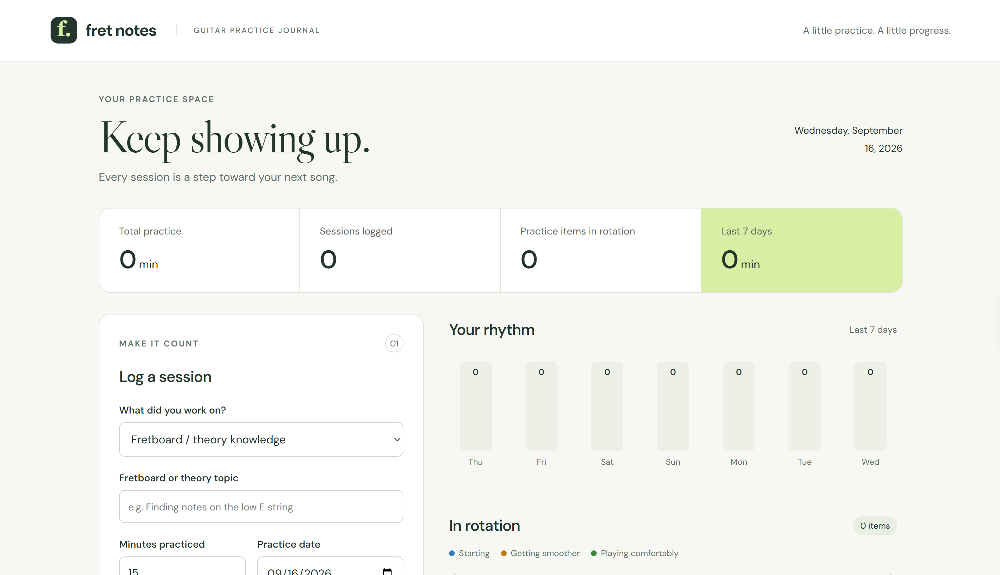
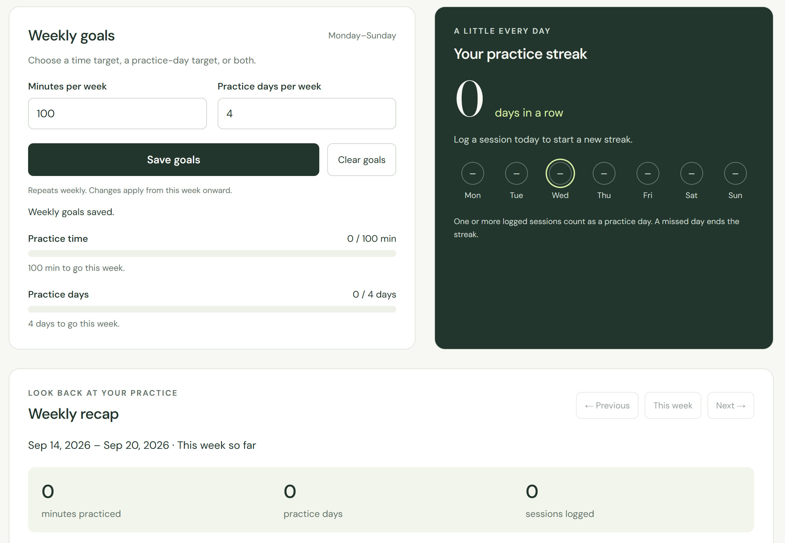

# Fret Notes

A small guitar practice journal built with TypeScript, HTML, and CSS. Choose a practice category (scales, songs, technique / accuracy, fretboard / theory knowledge, or miscellaneous), then log a name or topic, minutes practiced, a date, progress, and notes. Search history by name, category, or notes and combine the search with a category filter. Every log includes an editable category. The journal calculates totals, visualizes the past seven days, and groups sessions into a song collection.

## Files

- `src/app.ts`: session types, input validation, local storage, calculations, and DOM rendering.
- `index.html`: accessible page structure and session form.
- `styles.css`: responsive layout and visual styling.
- `app.js`: generated browser JavaScript.

## Run locally

Run `python3 -m http.server 8000` and open `http://localhost:8000`.

## Rebuild after editing TypeScript

With Node.js 22.13 or later, run `node build.mjs`. This removes TypeScript annotations; it does not type-check. You can also compile using the TypeScript compiler with `tsc src/app.ts --target ES2022 --lib ES2022,DOM --outDir . --strict` when installed.

## How it works

1. The form passes input to `createSession`.
2. `validateInput` checks the text, minutes, date, progress, and notes.
3. `persist` saves the session array to localStorage before updating state.
4. `render` uses `filter`, `reduce`, `sort`, and a `Map` to calculate totals, daily minutes, and the latest progress for each song.
5. DOM nodes use `textContent` so entered notes are displayed as text.

Practice names are grouped by category without case sensitivity, so identically named activities in different categories remain separate. Older logs without a category appear as Uncategorized and can be categorized from history without losing their original details. Starting is blue, getting smoother is amber, and playing comfortably is green; each color is paired with a text label. Progress comes from the most recent practice date, using the save timestamp to break ties. Backdated sessions contribute to totals without replacing more recent progress. A removal updates all summaries. No sample sessions are recorded as real practice.

Data is saved only in the current browser and origin. Clearing browser data removes it; it does not sync between devices. Changing the hosting address creates a separate storage space. Fonts are optional Google Fonts with local fallbacks. The optional WebMCP integration exposes the same validated session-saving action in supporting browsers.

## Goals, streaks, and weekly recaps

- Weekly goals can target total minutes, distinct practice days, or both. Goals repeat in Monday–Sunday calendar weeks, with changes effective from the current week onward. Older weeks keep their earlier target. Goals are stored separately from sessions. Clearing goals affects this week and future weeks.
- The current streak counts consecutive distinct practice dates ending today, or yesterday while there is still time to practice today. A fully missed day breaks the streak. Multiple sessions in one day count once. Calendar arithmetic uses local dates so daylight-saving changes do not break streaks.
- Weekly recaps summarize minutes, practice days, session counts, category totals, and activities with their latest recorded progress in that week. Previous/next controls navigate recorded weeks; future weeks are disabled. The existing seven-day chart remains a rolling seven-day view.
- All progress is calculated from logged practice dates, including backdated sessions; removal and category changes recalculate it. History filters do not affect goals, streaks, or recap totals. The recap is an in-app view, not an emailed notification.

## Publish on GitHub Pages

1. Create a public repository named `fret-notes` on GitHub.
2. Upload the contents of this folder, including `src/`, so `index.html` is at the top level of the repository. Upload the extracted files, not the ZIP itself.
3. Commit the files to `main`.
4. Open Settings > Pages. Set Source to Deploy from a branch, select `main` and `/(root)`, then Save.
5. Use the live URL GitHub shows after deployment. With the username `rockymacasio` and repository `fret-notes`, the default project URL is `https://rockymacasio.github.io/fret-notes/`.

The JavaScript is already built, so Node.js is not needed to upload or publish this version. After future TypeScript changes, rebuild `app.js` and upload it along with `src/app.ts`. Changes made to the separate ChatGPT Site do not automatically update this GitHub copy.

The published app code is public. Actual practice records and goals stay in each visitor's browser; none are bundled in this download. Browser storage is tied to the hosting origin, so records on the ChatGPT Site do not automatically transfer to GitHub Pages.

## Development

Rocky Acasio proposed and refined the practice categories, progress states, search, goals, streaks, and weekly recap. Implementation was created with ChatGPT assistance.
